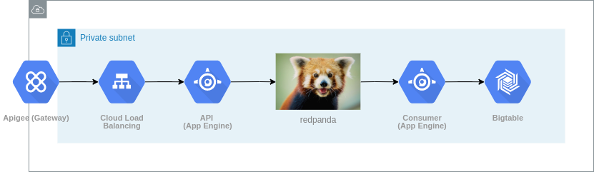

- Feature Name: Metrics
- Start Date: 2020-01-07
- Authors: David Castillo <david@vectorized.io>

# Executive Summary

We want to develop _dial-home_ functionality to understand cluster usage,
eventually using the collected data to develop telemetry, analytics and
alerting functionality for managed redpanda clusters. This will be the base for
our SasS offering in the near future.

The proposed design uses redpanda as a core component, which will allow us to
get operational experience during upgrades, deployments and management, and
allow us to find blind spots in our deployment processes.

## What is being proposed

Build a system to collect resource usage and environment and configuration data
from rpk and redpanda.

## Why (short reason)

1. To collect data that will help us better understand the way that our clients are
using redpanda, which can help guide the design of future features, as well as
to aid us in diagnosing a problem. This will be one of the main features for our
SaaS offering.

2. To experience operating a cluster to detect blind spots in our deployments,
including upgrading and downgrading clusters in case of errors

## How (short plan)

Writing an HTTP service to receive the metric requests and proxy them to a
redpanda cluster, from which the events will be extracted by another service
and stored on Bigtable.

Adding a new command to rpk, `status`, that will gather environment and
configuration data and post it to the API.

Creating a new optional systemd service, called `redpanda-housekeeping`, that
will run periodically and execute `rpk status`.

## Impact

This will help us give our customers a better experience, allowing us to
understand how they are using redpanda "in the wild" and helping us plan new
features by analyzing the gathered data.

It's also expected that we should find some blind spots in our deployment
process, giving us a chance to fix it or make it more friendly before shipping
it to our clients.

It will also strenghten our brand by reinforcing our "batteries included" offer.

# Motivation
## Why are we doing this?

Right now we would have no way of knowing what's going on in the clusters we
deploy. Should an outage occur on one of our customers' systems, we'd be blind
with regards to debugging, and we could never detect trends (in latency,
resource usage, etc.) automatically.

Also, as mentioned above, it's a great opportunity to use redpanda in a real
scenario (albeit not a high-data-volumes one, at least at the beginning) inside
Vectorized.

## What use cases does it support?

Making it easier to detect troublesome scenarios before they materialize
(proactive) and making it easier to debug the current state of a cluster
when an outage/ error happens (reactive).

Also, planning new features based on the data that this system will allow us to
gather.

## What is the expected outcome?

A working system that collects resource usage metrics, installation and
environment data from rpk and redpanda so that it can be queried and analyzed
further.

# Guide-level explanation
## How do we teach this?

To be able to give our customers the best service possible, we collect usage
metrics from rpk and redpanda. With them, we're able to analyze how our clients
are using redpanda, plan new features to better suit their needs, and help us
debug their systems when something isn't working as it should.

# Reference-level explanation

## Interaction with other features

The `status` subcommand will have to be added to `rpk`. It should reuse the
available checkers to gather the system info and print it. To send the data, the
user should pass a `--send` flag.

## Telemetry & Observability

Stackdriver will be used to monitor the deployed components, and a Prometheus
instance could be deployed too, to scrape the metrics already exported by
redpanda.

## Corner cases dissected by example.

- The sysadmin could disable the systemd timer that triggers `rpk status`, in
  which case we'd have no way of geting the metrics data.

## Detailed design - What needs to change to get there

The redpanda cluster has to be deployed, using the available `vtools infra`
command. The resulting Terraform state should be saved remotely so anyone can
download it to make changes to the infrastructure later. Bucket storage is
usually ok.

The API needs to be written and deployed, as well as the consumer service that
will read the metric events from redpanda and write them to the database.

`rpk` should make a fire-and-forget request with environment and configuration
data when it starts redpanda.

The `status` subcommand will have to be added to `rpk`. It should reuse the
available checkers to gather the system info and post a request to the API.

A new systemd service that executes `rpk status` periodically will also have
to be added to our DEB and RPM packages.

The architecture is described below.

## Detailed design - How it works


[Available here as a draw.io file](https://drive.google.com/file/d/1F1BCtU_T0fgZUitPmc5b0doo3v90nX6g/view?usp=sharing)

Rpk and redpanda will emit metrics as HTTP requests, which will be routed by a
load balancer to instances of a `metrics API` service.

There are 2 type of metrics:
- Configuration and environment: Sent once every time rpk starts redpanda up,
  and stored directly into Bigtable.
- Resource usage: Sent every 5 minutes. Includes CPU%, free storage space and
  free memory left.

The load balancer and services will be inside a VPC and guarded
by an API gateway, for centralized auth.

The resource usage metrics are written into redpanda, and from there, a
`consumer` service will read them as they arrive and store them into Bigtable.

### Metrics API

A Go service with a simple HTTP API to send metrics events.

**API**

- POST /env
  Content-Type: application/json
  Auth: Bearer
  X-V-Customer: customer id
  X-RP-Cluster: cluster id
  X-RP-Node-Id: node id
  Body schema: checker results + configuration fields

- POST /metrics
  Content-Type: application/json
  Auth: Bearer
  X-V-Customer: customer id
  X-RP-Cluster: cluster id
  X-RP-Node-Id: node id
  Body schema:
  ```json
  {
    "cpu%": 80,
    "freeStorageMb": 123456789,
    "freeMemoryMb": 123456789
  }
  ```

### Consumer

A Go service to consume the usage metrics events from the redpanda cluster and
store them into Bigtable.

### Database

The data will be stored in 2 tables: `resources_usage` and `environment`.
- `resources_usage` will hold historical resource usage data, such as CPU,
  disk and memory.
  Key: <client's reverse domain>.<cluster id>.<node id>
- `environment` will keep a record of the environment and configuration for
  each cluster node when it started.
  Key: <client's reverse domain>.<cluster id>.<node id>.<reverse timestamp>
  
---

The keys are designed that way so that a client's rows are always grouped
together (since Bigtable sorts rows ascending). For the `environment` table,
the reverse timestamp (subtracting the timestamp from the maximum integer value)
guarantees that the latest values always appear first, which will guarantee
faster queries.

## Drawbacks

It will take time and effort that we could use to enhance rpk or redpanda.
As stated in _Alternatives_, we could also use an existing metrics SAAS, like
Datadog or SignalFX, but we'd eventually need to migrate to our own system.

## Rationale and Alternatives

This is a fairly simple stripped back system, but it's meant to be like that
because we'd like to have it deployed and working before our first release on
Jan 31st. After that, given that the API decouples the rpk from the backend, we
could migrate to a different DB, monitoring service, or build new components on
top of it, like an alerting service.

Bigtable is proposed as the storage engine because of its fast reads for
adjacent rows.

The main strong points for the proposed alternative are:
- it's a clear chance for Vectorized to use redpanda internally: the system
  could be comprised of a proxy service to receive requests and send them into a
  redpanda cluster, from which a set of services would consume them and store them
  into a database.

- down the road, when Vectorized builds its SAAS offering, we're gonna need
  such a system anyway, with a couple more features (such as dashboards), but this
  will be the cornerstone.

- it's extensible, allowing us to build upon it as we discover more needs.

- it uses a _push_ approach, as opposed to Prometheus's _scrape**. This gets rid of
  the problem of having to dinamically add and remove targets from prometheus's
  configuration, as each node comes up or is removed.

- it gives us the freedom to export data of any type and structure, where as
  Datadog and Prometheus only allow numeric values.

### Aternatives:

**Prometheus***

Discarded for the reasons stated above.

**Using existing services**

Using existing services like Datadog would be straightforward, leaving us only
to make the required calls in the redpanda/ rpk code, or to build a proxy server
to redirect the events to Datadog if it should be necessary (e.g. to have more
fine-grained control over requests or centralized auth**.

However, we would need to migrate to our own solution down the road, somewhere
in 2021 - 2022 when we present our SAAS offering (we wouldn't want to have to
redirect our clients from our web app to datadog to see their dashboards).

**Not collecting metrics**

As stated above, not collecting metrics would leave us blind, preventing us to
give our customers the best experience possible.

## Future work

- Upgrade notifications

  We should use the requests to /metrics to check if a new redpanda version is
  available. If so, we could respond with its info and rpk could log something
  like "There's a new redpanda version available, please run rpm update".

- Alerting

  Getting email and slack notifications triggered by specific query results
  would be a huge win for the Vectorized dev team.

- Log processing
  
  In the future, we could leverage Splunk or Elk to store and process our logs.

- Core dumps

  Enabling our clients to upload (or doing it automatically) core dumps could
  aid us in diagnosing hard-to-find bugs. Extending the metrics API to allow
  that, and to analyze the uploaded files automatically would be a great next
  step.
