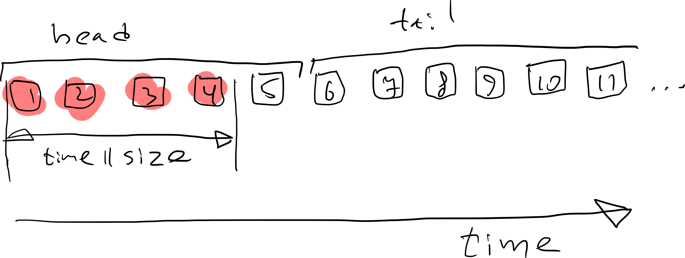
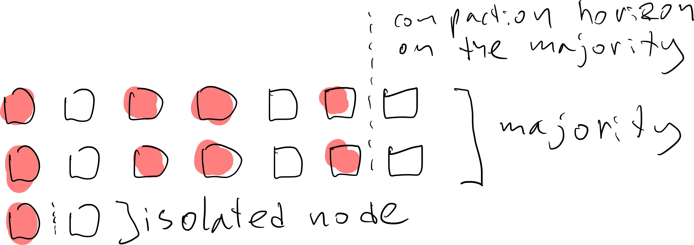

- Feature Name: Raft snapshots
- Status: draft
- Start Date: 2022-01-31
- Authors: Denis Rystsov
- Issue: TBD

# Executive Summary

Introduce Raft snapshots not bound to log truncation in order to solve compaction-related problems with idempotency, transactions, and offset translator, and pave the way to custom state machines.

## What is being proposed

Make the snapshot before the compaction and ship it to all (or the majority of) the nodes in a cluster so that each node sees the same aggregate of the log. Currently, when Redpanda does compaction, it introduces holes to the log and when a follower replays the log to build an aggregate, it ends up with different view.

# Motivation
## Why are we doing this?

To fix existing problems that prevent transactions from working with the compacted topics. To introduce infrastructure that supports custom (probably WASM based) state machines.

## What use cases does it support?

 - Idempotency
 - Transactions
 - Offset translator
 - Custom state machines

# Guide-level explanation
## Context

Some of the Redpanda operations require knowledge about all of the records that are passed through the partition (Raft log) up to the current moment (let's call them aggregate-dependent).
 
 - Idempotency: Redpanda inspects the messages to update the list of ongoing sessions and then uses the list to reject the out-of-order requests.
 - Offset translator: Redpanda tracks the reconfiguration batches to adjust Raft offsets into Kafka offsets.
 - Transactions: Redpanda inspects the records to keep an eye on the ongoing transactions and maintain the right consistency level.
 
At the same time, disks have limited capacity and data eventually loses actuality, so Redpanda supports multiple cleanup policies:
 
 - Deletion
 - Compaction
 
The deletion clean up policy removes some messages (defined by age or size) from the head of the log.

The compaction clean up policy is a bit more complicated. Each record in Redpanda has a key and when compaction is enabled, Redpanda keeps a record at the tail of the log, but removes some or all of the records with the same key written before it.

## Problem

There is a problem with the integration of aggregate-dependent operations and the cleanup policies: Redpanda may remove data before the operation sees it. This is especially possible during reconfiguration because the new node has never seen a non-compacted log).

For example, imagine that Redpanda stores withdraw and deposit history for a set of accounts and an aggregate-dependent operation needs an account balance.

We see that the state after compaction is completely different: `(2,-2,4)` vs `(3,1,4)`. The only way to guarantee the correct result is to cache the state before the compaction / deletion.

Local caching isn't enough. Raft tolerates node failures as long as the majority are connected. This means a single node may fall behind the majority and behind the compaction horizon.

When the isolated node rejoins the cluster it fetches an already-compacted log with holes, and the state diverges.

# Reference-level explanation

## Approach #1: Ship the snapshot (cached state) via the log

The main idea is to use existing log replication to ship the snapshot. It's easier to implement, but just like the reconfiguration batches, it shifts the offsets and requires that we continue to rely on offset translation.

### Overview

When a leader decides to do compaction at offset X, it:
 
  1. saves the current snapshot
  2. waits until it's safe to do compaction:
    a. segment containing X is closed
    b. tx front is passed the end of the segment
  3. replicates the snapshot
 
When a leader or a follower sees the snapshot via `state_machine::apply` (this only happens when the batch is replicated to the majority and can't be lost), it:

  - performs the compaction when the current node is the leader and it sent the snapshot (within the current term)
  - when the snapshot isn't applied:
    1. rewinds log at offset X
    2. applies the snapshot
  - when the snapshot is applied:
    - performs the compaction

There is a problem with this approach: a follower doesn't know if the batches it replays contain holes, so its current state may be incorrect until it sees the snapshot batch. This becomes a problem when Redpanda supports reads from replicas. There are several ways to handle this: 

#### Block replica reads

A follower is allowed to serve reads only up to the last observed snapshot. Even when the prior batches contain holes, they become visible when the snapshot is applied and corrected.

#### Modify the `append_entries_request`

We can modify the `append_enties_request` to include an offset of the last compaction. When a follower sees that last compaction is less than the current offset, it knows that the latest batches don't have holes and it's safe to serve the requests.

When we modify `append_entries_request` or when we introduce and switch to the new API, we need to take upgrades into account. In order to avoid shutting down a cluster for an update, we need to put the change behind a feature flag, update the brokers one by one, and only then active the feature.

## Approach #2: Ship the snapshot (cached state) via the new API

Alternatively, we could use a side channel instead of the main replication path to ship the snapshot. With this approach we don't shift the offset and it eventually opens a way to get rid of the offset translation layer.

### Overview

When a leader decides to compact the log at offset X, it:

  1. makes a snapshot and sends it to a majority of the nodes via the new API
  2. waits until it's safe to do compaction:
    a. the segment containing X is closed
    b. tx front is passed the end of the segment
  3. starts include the new offset X to the `append_entries_request`
  4. performs the compaction
 
When a follower observes a compacted offset past its snapshot via `append_entries_request`, it:

  1. queries all nodes to find a node that has the snapshot (this is a majority of the nodes, so the availability is the same as with Raft)
  2. downloads the snapshot
  3. applies the snapshot
  4. rewinds the snapshot to the snapshot's offset
  5. acknowledges the `append_entries_request`

It's safe to serve read from a replica bounded by the last snapshot's offset or by current offset if the compacted offset is equal to the last snapshot.

## Interaction with other features

The RFC doesn't cover the Shadow Indexing code path, but it seems that it should compatible with the changes, please comment if you see any concerns.

## Telemetry and observability

We can monitor the size of the snapshot and the lag between the offset that a follower saw and the consumable offset.

## Rationale and alternatives

Shipping via the log gives us results faster, while shipping via a new API takes more time to implement. However, if we don't want to limit the horizon of read replicas by the last compaction time (the last snapshot), we need to modify `append_entries_request` to include the compacted offset, and it is inline with shipping snapshots via the new API. So we may start with the fast solution and then morph it into one which doesn't shift the offsets without reworking everything.

  1. Ship snapshot via the log
  2. Modify `append_entries_request`
  3. Ship the log via the new API

With this plan we'll get actionable results at each step. The alternative is to jump directly to step three.

## Unresolved questions

Should we do anything with respect to:
- Integration with Shadow Indexing
- Integration with Wasm Data Transform