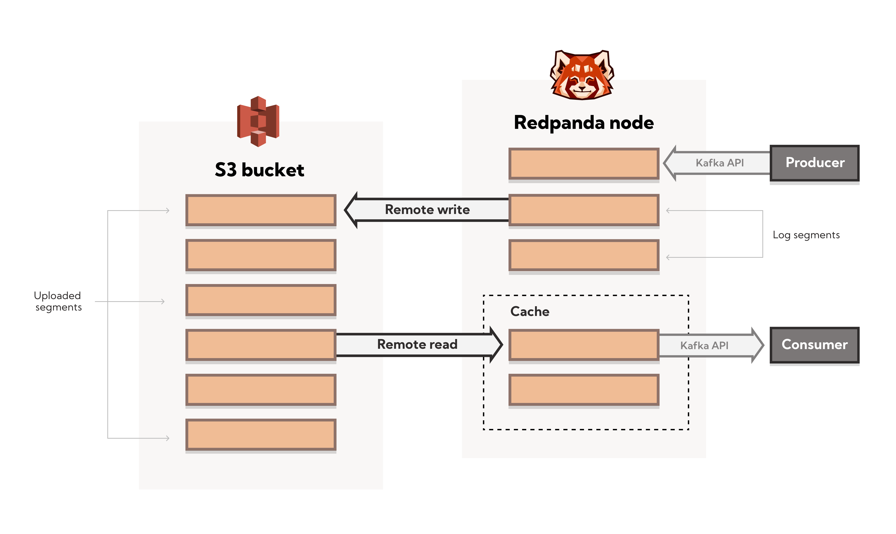

## Shadow Indexing


Shadow Indexing is a multi-tiered remote storage solution that provides the ability to archive log segments to a cloud object store in real time as the topic is being produced. You can recover a topic that no longer exists in the cluster, and replay and read log data as a stream directly from cloud storage even if it doesn’t exist in the cluster. Shadow Indexing provides a disaster recovery plan that takes advantage of infinitely scalable storage systems, is easy to configure, and works in real time.

---
**_Note:_** 
* This feature is in technical preview; a cluster with this feature enabled is not yet supported for production.
* Shadow Indexing is available for Redpanda 21.11.3 and later.
---

The image below illustrates the Shadow Indexing architecture. Remote write uploads data from Redpanda to cloud storage. Remote read fetches data from cloud storage to Redpanda. 



## Setting up

Shadow Indexing is supported for Amazon S3 and Google Cloud Storage. Before you enable Shadow Indexing for a topic, you must configure cloud storage in the `redpanda.yaml` file. 

After cloud storage is enabled and configured, you can either enable Shadow Indexing on a cluster, or simply enable Shadow Indexing on a topic with a single command. 


### Configuring Amazon S3

Complete the following tasks to create a cloud storage bucket and configure Redpanda before you enable Shadow Indexing for Amazon S3: 

1. Specify the expiration rules for the files that are based on the `rp-type` file tags. 
2. Use the IAM service to create a user that you will use to access S3. 
3. Grant the user permission to read and create objects in cloud storage.
4. Copy the access key and secret key for the `cloud_storage_access_key` and `cloud_storage_secret_key` parameters in the `redpanda.yaml` file. 
5. The sections below give detailed information on all of the cloud storage configuration options, but the parameters listed here are the minimum required parameters that you must configure in the `redpanda.yaml` file to use Shadow Indexing for Amazon S3: 

        ```
        cloud_storage_enabled: true
        cloud_storage_access_key: ***
        cloud_storage_secret_key: ***
        cloud_storage_region: eu-north-1
        cloud_storage_bucket: pandabucket

        ```

### Configuring Google Cloud Storage

Complete the following tasks to create a cloud storage bucket and configure Redpanda before you enable Shadow Indexing for Google Cloud Storage:

1. Choose a uniform access control when you create the bucket. 
2. Use a Google managed encryption key. 
3. Set a [default project](https://cloud.google.com/storage/docs/migrating#defaultproj). 
4. Create a service user with [HMAC keys](https://cloud.google.com/storage/docs/authentication/managing-hmackeys) and copy the access key and secret key for the `cloud_storage_access_key` and `cloud_storage_secret_key` parameters in the `redpanda.yaml` file.
5. The sections below give detailed information on all of the cloud storage configuration options, but the parameters listed here are the minimum required parameters to use Shadow Indexing for Google Cloud Storage:

        ```
        cloud_storage_access_key: ***
        cloud_storage_api_endpoint: storage.googleapis.com
        cloud_storage_bucket: pandabucket
        cloud_storage_enabled: true
        cloud_storage_region: eu-north-1
        cloud_storage_secret_key: ***

        ```

### Enabling Shadow Indexing for a cluster

You can enable Shadow Indexing for a cluster or for a topic. Topic-level tags override cluster-level settings. For example, if you have Shadow Indexing enabled on the cluster and you create a topic with Shadow Indexing turned off, it will be turned off for that topic. 

When you enable Shadow Indexing on a cluster, it will become enabled for already-existing topics. 

To enable Shadow Indexing on a cluster, set the following parameters in the `redpanda.yaml` file:  


* `cloud_storage_enable_remote_write` - Enables data upload from Redpanda to cloud storage. Set to `true`. 
* `cloud_storage_enable_remote_read` - Enables Redpanda to fetch data from cloud storage. Set to `true`. 
* `cloud_storage_enabled` - Global flag that enables Shadow Indexing. Set to `true` to enable Shadow Indexing. Note that this parameter must be set to `true` to enable Shadow Indexing at the cluster level or the topic level. Default is `false`.


### Enabling Shadow Indexing for a topic

Shadow Indexing also uses the following topic configuration flags, which are described in detail in the sections below: 


* `redpanda.remote.write` - Uploads data from Redpanda to cloud storage. Overrides the cluster-level `cloud_storage_enable_remote_write` configuration for the topic. 
* `redpanda.remote.read` - Fetches data from cloud storage to Redpanda. Overrides the cluster-level `cloud_storage_enable_reamote_read` configuration for the topic.
* `redpanda.remote.recovery` - Recovers or reproduces a topic from cloud storage. Use this flag during topic creation. It does not apply to existing topics. 

Note: For cloud customers, Shadow Indexing is turned off by default. You can turn it on for a topic using the topic configuration flags with the `rpk` CLI tool. 

When you use the topic configuration flags, they override whatever cluster-level configuration you have for Shadow Indexing. If `cloud_storage_enable_remote_write` is set to `true`, you can set `redpanda.remote.write` to `false` to turn it off for a particular topic. Or if you have Shadow Indexing turned off for the cluster, you can enable it for individual topics with the topic flags. 

The table below gives the outcomes for the possible combinations of cluster-level and topic-level configurations: 

**Table 1: Remote write configuration**

| Cluster-level configuration <br />(<code>cloud_storage_remote_write</code>) | Topic-level configuration <br />(<code>redpanda.remote.write</code>) | Outcome <br />(whether remote write is enabled <br />or disabled on the topic) |
| --------           | ------             | ----     |
| <code>true</code>  | Not set            | Enabled  |
| <code>true</code>  | <code>false</code> | Disabled |
| <code>true</code>  | <code>true</code>  | Enabled  |
| <code>false</code> | Not set            | Disabled |
| <code>false</code> | <code>false</code> | Disabled |
| <code>false</code> | <code>true</code>  | Enabled  |


**Table 2: Remote read configuration**

| Cluster-level configuration <br />(<code>cloud_storage_remote_read</code>) | Topic-level configuration <br />(<code>redpanda.remote.read</code>) | Outcome <br />(whether remote read is enabled <br />or disabled on the topic) |
| --------           | ------             | ----     |
| <code>true</code>  | Not set            | Enabled  |
| <code>true</code>  | <code>false</code> | Disabled |
| <code>true</code>  | <code>true</code>  | Enabled  |
| <code>false</code> | Not set            | Disabled |
| <code>false</code> | <code>false</code> | Disabled |
| <code>false</code> | <code>true</code>  | Enabled  |


Note that the cluster-level `cloud_storage_enabled` parameter must be set to `true` to enable Shadow Indexing at the cluster level or the topic level. If you want to have Shadow Indexing turned off at the cluster level and enable it on specific topics, you must enable the `cloud_storage_enabled` parameter. If this parameter is set to `false`, nothing will be added to cloud storage, whether or not the other Shadow Indexing parameters are enabled. If this parameter is set to `true` and the other Shadow Indexing parameters are disabled, the Shadow Indexing subsystem will be initialized, but will not be used until you enable Shadow Indexing for a topic or at the cluster level. 

To enable Shadow Indexing on a topic, you can set the `redpanda.remote.write` and `redpanda.remote.read` flags on a new topic or an existing topic. Use the following command to create a new topic with Shadow Indexing enabled: 


```
    rpk topic create <topic-name> -c redpanda.remote.read=true -c redpanda.remote.write=true
```


And use this command to enable Shadow Indexing on an existing topic: 


```
    rpk topic alter-config <topic-name> --set redpanda.remote.read=true --set redpanda.remote.write=true
```


## Remote write

Remote write is the process that constantly uploads log segments to cloud storage. The process is created for each partition and runs on the leader node of the partition. It only uploads the segments that contain only offsets that are smaller than the last stable offset. This is the largest offset that the client can read. 

To enable Shadow Indexing, use remote write in conjunction with remote read. If you only enable remote write on a topic, you will have a simple backup that you will still be able to run recovery on. 

To create a topic with remote write enabled, use this command: 


```
    rpk topic create <topic-name> -c -c redpanda.remote.write=true
```


And to enable remote write on an existing topic, use this command: 


```
    rpk topic alter-config <topic-name> --set redpanda.remote.write=true
```


If remote write is enabled, log segments will not be deleted until they’re uploaded to remote storage. Because of this, the log segments may exceed the configured retention period until they’re uploaded, so the topic might require more disk space. This prevents data loss if segments cannot be uploaded fast enough or if the retention period is very short. 

If you delete a topic that has been uploaded to cloud storage, the data in cloud storage will not be affected. This is useful if a topic is unintentionally deleted. The topic can be recovered with the `redpanda.remote.recovery` topic configuration flag. 


### Idle timeout

You can configure Redpanda to start a remote write periodically. This is useful if the ingestion rate is low and the segments are kept open for long periods of time. You specify a number of seconds for the timeout, and if that time has passed since the previous write and the partition has new data, Redpanda will start a new write. This limits data loss in the event of catastrophic failure and adds a guarantee that you will only lose the specified number of seconds of data. 

Use the `cloud_storage_segment_max_upload_interval_sec` parameter in the `redpanda.yaml` file to set the number of seconds for idle timeout. If this parameter is empty, Redpanda will upload metadata to the cloud storage, but the segment will not be uploaded until it reaches the `segment.bytes` size. By default, the parameter is empty. 


### Reconciliation 

Reconciliation is a Redpanda process that runs periodically on every node. It monitors partitions and decides which partitions will be uploaded on each Redpanda node to guarantee that the data is uploaded only once. It also balances the workload evenly between the nodes. 

When leadership rebalancing occurs, the reconciliation process might stop uploads on one node and start them on another node. 

The reconciliation process is configured with the following parameter in the `redpanda.yaml` file: 


* `cloud_storage_reconciliation_interval_ms` - Sets the interval, in milliseconds, that is used to reconcile partitions that need to be uploaded. A long reconciliation interval can result in a delayed reaction to topic creation, topic deletion, or leadership rebalancing events. A short reconciliation interval guarantees that new partitions are picked up quickly, but the process uses more resources. Default is 10000ms.


### Upload controller

Remote write uses a proportional derivative (PD) controller to minimize the backlog size for the write. The backlog consists of the data that has not been uploaded to cloud storage but must be uploaded eventually. 

The upload controller prevents Redpanda from running out of disk space. If `remote.write` is set to `true`, Redpanda cannot evict log segments that have not been uploaded to cloud storage. If the remote write process cannot keep up with the amount of data that needs to be uploaded to cloud storage, the upload controller increases priority for the upload process. The upload controller measures the size of the upload periodically and tunes the priority of the remote write process. 


## Remote read

Remote read fetches data from cloud storage using the Kafka API. Use remote read in conjunction with remote write to enable Shadow Indexing. If you use remote read without remote write, there will be nothing for Redpanda to read. 

Normally, when data is evicted locally, it is no longer available. If the consumer starts consuming the partition from the beginning, the first offset will be the smallest offset available locally. However, if Shadow Indexing is enabled with the `redpanda.remote.read` and `redpanda.remote.write` flags, the data is always uploaded to remote storage before it is deleted. This guarantees that the data is always available either locally or remotely. 

When data is available remotely and Shadow Indexing is enabled, the client can start consuming data from offset 0 even if the data is no longer stored locally. 

To create a topic with remote read enabled, use this command: 


```
    rpk topic create <topic-name> -c -c redpanda.remote.read=true
```


And to enable remote read on an existing topic, use this command: 


```
    rpk topic alter-config <topic-name> --set redpanda.remote.read=true
```


### Caching 

When the Kafka client fetches an offset range that isn’t available locally in the Redpanda data directory, Redpanda downloads remote segments from cloud storage. These downloaded segments are stored in the cloud storage cache directory. The cache directory is created in the Redpanda `data` directory by default, but it can be placed anywhere in the system. For example, you might want to put the cache directory to a dedicated drive with cheaper storage. 

If you don’t specify a cache location in the `redpanda.yaml` file, the cache directory will be created here: 

`<redpanda-data-directory>/cloud_storage_cache`. 

Use the `cloud_storage_cache_directory` parameter in the `redpanda.yaml` file to specify a different location for the cache directory. You must specify the full path. 

Redpanda checks the cache periodically, and if the size of the stored data is larger than the configured limit, the eviction process starts. The eviction process removes segments that haven’t been accessed recently, until the size of the cache drops 20%. 

Use the following parameters in the `redpanda.yaml` file to set the maximum cache size and cache check interval: 


* `cloud_storage_cache_size` - Maximum size of the disk cache that is used by Shadow Indexing. Default is 20GiB.
* `cloud_storage_cache_check_interval` - The time, in milliseconds, between cache checks. The size of the cache can grow quickly, so it’s important to have a small interval between checks, but if the checks are too frequent, they will consume a lot of resources. Default is 30000ms. 


## Remote recovery 

When you create a topic, you can use remote recovery to download the topic data from cloud storage. Only the data that matches the retention policy of the topic will be downloaded. The data that is not downloaded from cloud storage will still be accessible through remote read. 

You can use remote recovery to restore a topic that was deleted from a cluster, or you can replicate a topic in another cluster. 

Use the following command to create a new topic using remote recovery: 


```
rpk topic create <topic-name> -c redpanda.remote.recovery=true
```


You can also create a new topic using remote recovery and enable Shadow Indexing on the new topic by adding the `redpanda.remote.write` and `redpanda.remote.read` flags: 


```
    rpk topic create <topic-name> -c redpanda.recovery=true -c redpanda.remote.write=true -c redpanda.remote.read=true
```


## Retries and backoff 

If the cloud provider replies with an error message that the server is busy, Redpanda will retry the request. Redpanda always uses exponential backoff with cloud connections. 

Redpanda retries the request if it receives any the following errors: 


* Connection refused
* Connection reset by peer
* Connection timed out
* Slow down REST API error

For other errors, Redpanda will not retry the request. For example, Redpanda will not retry the request after a `NoSuchKey` error. 

In the `redpanda.yaml` file, you can configure the `cloud_storage_initial_backup_ms` parameter to set the time, in milliseconds, that is used as an initial backoff interval in the exponential backoff algorithm that is used to handle an error. The default is 100ms. 


## Transport 

Shadow Indexing creates a connection pool for each CPU that limits simultaneous connections to the cloud storage provider. It also uses persistent HTTP connections with a configurable maximum idle time. A custom S3 client is used to send and receive data. 

For normal usage, you will not need to configure the transport parameters. The Redpanda defaults will be sufficient and the certificates used to connect to the cloud storage client are available through public key infrastructure. Redpanda detects the location of the CA certificates automatically. 

Redpanda uses the following parameters in the `redpanda.yaml` file to configure transport: 


* `cloud_storage_max_connections` - The maximum number of connections to cloud storage on a node per CPU. Remote read and remote write share the same pool of connections. This means that if a connection is being used to upload a segment, it cannot be used to download another segment. If this value is too small, some workloads might starve for connections, which results in delayed uploads and downloads. If this value is too large, Redpanda will try to upload a lot of files at the same time and might overwhelm the system. Default is 20. 
* `cloud_storage_segment_upload_timeout_ms` - Timeout for segment upload. Redpanda retries the upload after the timeout. Default is 30000ms. 
* `cloud_storage_manifest_upload_timeout_ms` - Timeout for manifest upload. Redpanda retries the upload after the timeout. Default is 10000ms. 
* `cloud_storage_max_connection_idle_time_ms` - The maximum idle time for persistent HTTP connections. Differs depending on the cloud provider. Default is 5000ms, which will be sufficient for most providers. 
* `cloud_storage_segment_max_upload_interval_sec` - Sets the number of seconds for idle timeout. If this parameter is empty, Redpanda will upload metadata to the cloud storage, but the segment will not be uploaded until it reaches the `segment.bytes` size. By default, the parameter is empty. 
* `cloud_storage_trust_file` - The public certificate that is used to validate the TLS connection to cloud storage. If this is empty, Redpanda will use your operating system's CA cert pool.


## Configuration parameters

The list below contains all the available configuration parameters for Shadow Indexing in the `redpanda.yaml` file. 

You must configure the following parameters before you use Shadow Indexing: 


* `cloud_storage_enabled` - Global flag that enables Shadow Indexing. Set to true to enable Shadow Indexing. Default is false. 
* `cloud_storage_access_key` - Cloud storage access key. Required. 
* `cloud_storage_secret_key` - Cloud storage secret key. Required. 
* `cloud_storage_region` - Cloud storage region. Required. 
* `cloud_storage_bucket` - Cloud storage bucket name. Required. 
* `cloud_storage_api_endpoint` - API endpoint. This can be left blank for AWS, where it’s generated automatically using the region and bucket. For Google Cloud Service, use storage.googleapis.com. 
* `cloud_storage_cache_directory` - The directory for the Shadow Indexing cache. You must specify the full path. Default is: `&lt;redpanda-data-directory>/cloud_storage_cache. `
* `cloud_storage_cache_size` - Maximum size of the disk cache that is used by Shadow Indexing. Default is 20GiB.

You may want to configure these parameters: 


* `cloud_storage_max_connections` - The maximum number of connections to cloud storage on a node per CPU. Remote read and remote write share the same pool of connections. This means that if a connection is being used to upload a segment, it cannot be used to download another segment. If this value is too small, some workloads might starve for connections, which results in delayed uploads and downloads. If this value is too large, Redpanda will try to upload a lot of files at the same time and might overwhelm the system. Default is 20. 
* `cloud_storage_initial_backoff_ms` - The time, in milliseconds, that is used as an initial backoff interval in the exponential backoff algorithm that is used to handle an error. The default is 100ms. 
* `cloud_storage_segment_upload_timeout_ms` - Timeout for segment upload. Redpanda retries the upload after the timeout. Default is 30000ms. 
* `cloud_storage_manifest_upload_timeout_ms` - Timeout for manifest upload. Redpanda retries the upload after the timeout. Default is 10000ms. 
* `cloud_storage_max_connection_idle_time_ms` - The maximum idle time for persistent HTTP connections. Differs depending on the cloud provider. Default is 5000ms, which will be sufficient for most providers. 
* `cloud_storage_segment_max_upload_interval_sec` - Sets the number of seconds for idle timeout. If this parameter is empty, Redpanda will upload metadata to the cloud storage, but the segment will not be uploaded until it reaches the `segment.bytes` size. By default, the parameter is empty. 
* `cloud_storage_cache_check_interval` - The time, in milliseconds, between cache checks. The size of the cache can grow quickly, so it’s important to have a small interval between checks, but if the checks are too frequent, they will consume a lot of resources. Default is 30000ms. 

Under normal circumstances, you should not need to configure these parameters: 


* `cloud_storage_upload_ctrl_update_interval_ms` - The recompute interval for the upload controller. Default is 60000ms.
* `cloud_storage_upload_ctrl_p_coeff` - The proportional coefficient for the upload controller. Default is -2. 
* `cloud_storage_upload_ctrl_d_coeff` - The derivative coefficient for the upload controller. Default is 0. 
* `cloud_storage_upload_ctrl_min_shares` - The minimum number of I/O and CPU shares that the remote write process can use. Default is 100. 
* `cloud_storage_upload_ctrl_max_shares` - The maximum number of I/O and CPU shares that the remote write process can use. Default is 1000. 
* `cloud_storage_reconciliation_interval_ms` - Sets the interval, in milliseconds, that is used to reconcile partitions that need to be uploaded. A long reconciliation interval can result in a delayed reaction to topic creation, topic deletion, or leadership rebalancing events. A short reconciliation interval guarantees that new partitions are picked up quickly, but the process uses more resources. Default is 10000ms.
* `cloud_storage_disable_tls` - Disables TLS encryption. You can set this to true if TLS termination is done by the proxy, such as HAProxy. Default is false. 
* `cloud_storage_api_endpoint_port` - Overrides the default port for the TLS connection. Default is 443. 
* `cloud_storage_trust_file` - The public certificate that is used to validate the TLS connection to cloud storage. If this is empty, Redpanda will use your operating system's CA cert pool.