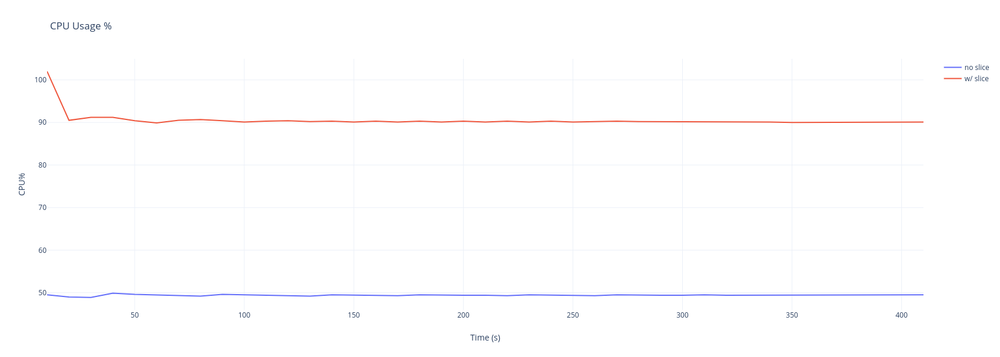

# Packaging tests

## Slice configuration

Tests that the systemd slice config correctly isolates and gives priority to
the processes running in it.

### CPU Test

Runs iotune for the duration specified, first with the redpanda slice, and then
without while running the specified number of CPU hog processes in parallel.
Meanwhile, it periodically checks the iotune process' CPU usage percentage with
`ps` and outputs it to a file so the results can be examined.

**How to run it**

> This test depends on `Python 3` and `ps`. 

- Install the latest redpanda package for the distro you're using.
- Run the test:
  ```sh
  ./test-slice.py [--id ID] [--duration DURATION]
                  [--interval INTERVAL] [--hogs HOGS]
  ```

**Latest results**:

Obtained by running: `sudo ./test-slice.py --id 1 --duration 600 --interval 10 --hogs 16`


